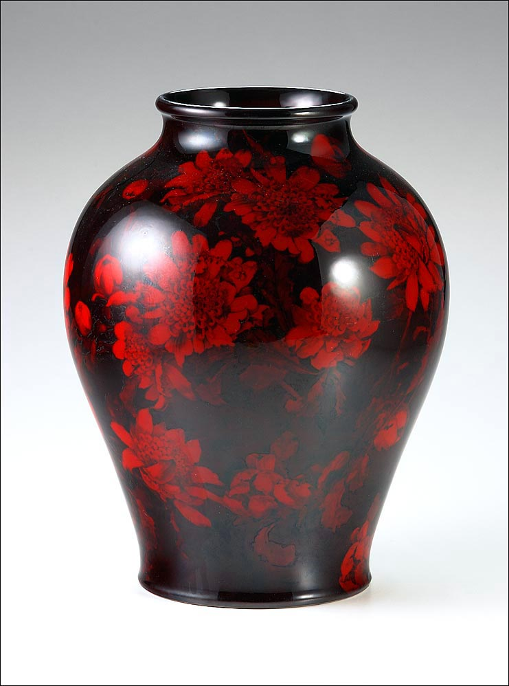

# 3D Vase

### 1. Goal ###

The goal was to use Three.js to render a vase similar to the one pictured below:
 

 

### 2. Usage ### 

#### 2a. Setup ####

Download the Three.js SceneUtils file from <a href="https://github.com/mrdoob/three.js/blob/master/examples/js/utils/SceneUtils.js">Github.</a>

Download index.html and rose.jpg from this repository.

Open index.html in a Firefox browser.

#### 2b. User Interaction #### 

To rotate the vase around the x, y, or z axis, press 'x', 'y', or 'z' on the keyboard, respectively.
